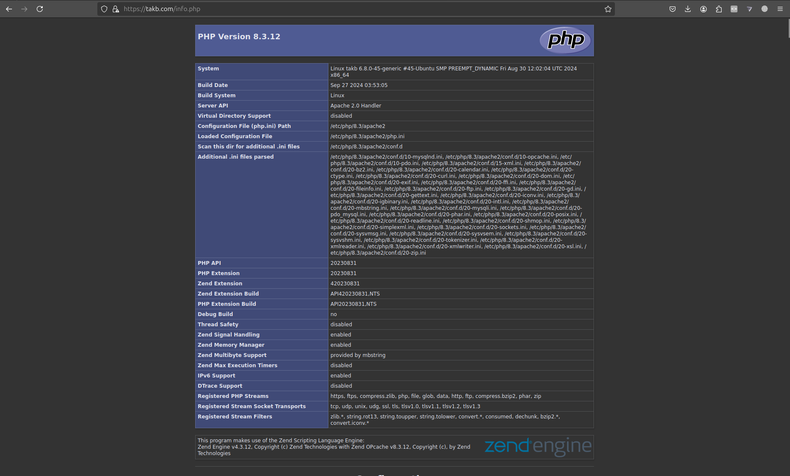

# ЛР №3
#### Чумаченко Александр, Татарников Максим А-07-22
<br><br>


<p style="color: aqua; font-weight: bold; font-size: 20px;">1. Apache2 на ВМ c Astra Linux</p>

---

#### 	Установка и работа Apache2:
•	Apache установлен, работает, и отображает приветственную страницу по адресу https://takb.com.



•	Проверить работу сервера с помощью команды:
sudo systemctl status apache2.
```
takb@takb:/var/www/takb.com$ sudo service apache2 status
[sudo] пароль для takb: 
● apache2.service - The Apache HTTP Server
     Loaded: loaded (/usr/lib/systemd/system/apache2.service; enabled; preset: >
     Active: active (running) since Fri 2024-11-15 13:03:40 MSK; 1h 10min ago
       Docs: https://httpd.apache.org/docs/2.4/
    Process: 2732188 ExecStart=/usr/sbin/apachectl start (code=exited, status=0>
   Main PID: 2732191 (apache2)
      Tasks: 7 (limit: 18771)
     Memory: 21.9M (peak: 22.4M)
        CPU: 304ms
     CGroup: /system.slice/apache2.service
             ├─2732191 /usr/sbin/apache2 -k start
             ├─2732193 /usr/sbin/apache2 -k start
             ├─2732194 /usr/sbin/apache2 -k start
             ├─2732195 /usr/sbin/apache2 -k start
             ├─2732196 /usr/sbin/apache2 -k start
             ├─2732197 /usr/sbin/apache2 -k start
             └─2733173 /usr/sbin/apache2 -k start

ноя 15 13:03:39 takb systemd[1]: Starting apache2.service - The Apache HTTP Ser>
ноя 15 13:03:40 takb systemd[1]: Started apache2.service - The Apache HTTP Serv>
lines 1-20/20 (END)
```

<br><br>

<p style="color: aqua; font-weight: bold; font-size: 20px;">2. Настройка веб-сервера Nginx c Astra Linux</p>

---

#### 1. Перечислите команды, которые использовались на каждом этапе.

```
```

---

#### 2. Скриншоты страниц, демонстрирующие работу сайтов site1.com и site2.com.

```
<screenshot> from site1.com
```

```
<screenshot> from site2.com
```

---

#### 3. Конфигурационные файлы настроенных серверных блоков.

```
```

---
