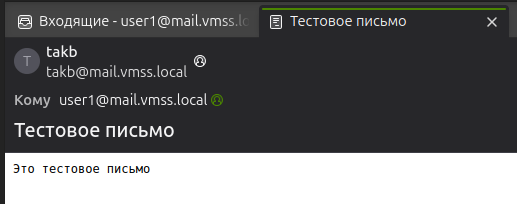

# Mail setup 


## 1. Postfix and Dovecot Setup

### Available
```bash
~ ❯ sudo systemctl status postfix                                                                                                                                                                
sudo systemctl status dovecot
● postfix.service - Postfix Mail Transport Agent
     Loaded: loaded (/usr/lib/systemd/system/postfix.service; enabled; preset: enabled)
     Active: active (exited) since Thu 2024-12-12 20:12:05 MSK; 9min ago
       Docs: man:postfix(1)
   Main PID: 1556048 (code=exited, status=0/SUCCESS)
        CPU: 2ms

дек 12 20:12:05 takb systemd[1]: Starting postfix.service - Postfix Mail Transport Agent...
дек 12 20:12:05 takb systemd[1]: Finished postfix.service - Postfix Mail Transport Agent.
● dovecot.service - Dovecot IMAP/POP3 email server
     Loaded: loaded (/usr/lib/systemd/system/dovecot.service; enabled; preset: enabled)
     Active: active (running) since Thu 2024-12-12 20:16:16 MSK; 5min ago
       Docs: man:dovecot(1)
             https://doc.dovecot.org/
   Main PID: 1556326 (dovecot)
     Status: "v2.3.21 (47349e2482) running"
      Tasks: 4 (limit: 18776)
     Memory: 3.6M (peak: 3.9M)
        CPU: 58ms
     CGroup: /system.slice/dovecot.service
             ├─1556326 /usr/sbin/dovecot -F
             ├─1556329 dovecot/anvil
             ├─1556330 dovecot/log
             └─1556331 dovecot/config

дек 12 20:16:16 takb systemd[1]: Starting dovecot.service - Dovecot IMAP/POP3 email server...
дек 12 20:16:16 takb dovecot[1556326]: master: Dovecot v2.3.21 (47349e2482) starting up for imap, pop3, lmtp, imap, lmtp, pop3 (core dumps disabled)
дек 12 20:16:16 takb systemd[1]: Started dovecot.service - Dovecot IMAP/POP3 email server.
~ ❯   
```  

### Ports

```bash
~ ❯ netstat -tuln | grep -E '25|143|110'                                                                                                                                                        
tcp        0      0 0.0.0.0:143             0.0.0.0:*               LISTEN     
tcp        0      0 0.0.0.0:25              0.0.0.0:*               LISTEN     
tcp        0      0 0.0.0.0:110             0.0.0.0:*               LISTEN     
tcp6       0      0 :::143                  :::*                    LISTEN     
tcp6       0      0 :::25                   :::*                    LISTEN     
tcp6       0      0 :::110                  :::*                    LISTEN     
udp        0      0 192.168.1.255:137       0.0.0.0:*                          
udp        0      0 172.17.255.255:137      0.0.0.0:*                          
udp        0      0 192.168.1.255:138       0.0.0.0:*                          
udp        0      0 172.17.255.255:138      0.0.0.0:*                          
udp6       0      0 :::52548                :::*                               
~ ❯    
```

## 2. Account setup

### User's mail folder

```bash
~ ❯ sudo ls /home/user1/mail                                         
cur			dovecot-uidlist		      maildirfolder
dovecot.index.log	dovecot-uidvalidity	      new
dovecot.list.index.log	dovecot-uidvalidity.675b538d  tmp
~ ❯ sudo ls /home/user2/mail                                          
cur			dovecot-uidlist		      maildirfolder
dovecot.index.log	dovecot-uidvalidity	      new
dovecot.list.index.log	dovecot-uidvalidity.675b5564  tmp
~ ❯    
```

## 3. SSL

## 4. Config check

No errors

```bash
~ ❯ sudo postfix check         
sudo dovecot reload
~ ❯        
```

## Get and post mails

```bash
~ ❯ echo "Это тестовое письмо" | mail -s "Тестовое письмо" user1@mail.vmss.local
~ ❯ sudo ls /home/user1/mail/new                                      
1734039864.V10308I160a522M616185.mail.vmss.local
```



Logs

```bash
~ ❯ sudo tail -f /var/log/mail.log                                     00:51:20
2024-12-13T00:44:24.623136+03:00 mail postfix/qmgr[35510]: 90C909676E2: removed
2024-12-13T00:44:52.890118+03:00 mail dovecot: pop3-login: Login: user=<user1>, method=PLAIN, rip=192.168.1.27, lip=192.168.1.27, mpid=63754, secured, session=<5ibWnxkptsbAqAEb>
2024-12-13T00:44:52.997505+03:00 mail dovecot: pop3(user1)<63754><5ibWnxkptsbAqAEb>: Disconnected: Logged out top=0/0, retr=1/522, del=0/3, size=1901
2024-12-13T00:45:55.568655+03:00 mail dovecot: pop3-login: Login: user=<user1>, method=PLAIN, rip=192.168.1.27, lip=192.168.1.27, mpid=64619, secured, session=<dp2SoxkpbMjAqAEb>
2024-12-13T00:45:55.577238+03:00 mail dovecot: pop3(user1)<64619><dp2SoxkpbMjAqAEb>: Disconnected: Logged out top=0/0, retr=0/0, del=0/3, size=1901
2024-12-13T00:47:46.168990+03:00 mail dovecot: pop3-login: Login: user=<user2>, method=PLAIN, rip=192.168.1.27, lip=192.168.1.27, mpid=66140, secured, session=<EXAqqhkp4qnAqAEb>
2024-12-13T00:47:46.190271+03:00 mail dovecot: pop3(user2)<66140><EXAqqhkp4qnAqAEb>: Disconnected: Logged out top=0/0, retr=0/0, del=0/1, size=673
2024-12-13T00:48:03.908780+03:00 mail dovecot: master: Warning: SIGHUP received - reloading configuration
2024-12-13T00:50:57.257600+03:00 mail dovecot: pop3-login: Login: user=<user1>, method=PLAIN, rip=127.0.0.1, lip=127.0.0.1, mpid=69023, TLS, session=<Sz6OtRkp6LZ/AAAB>
2024-12-13T00:50:57.332770+03:00 mail dovecot: pop3(user1)<69023><Sz6OtRkp6LZ/AAAB>: Disconnected: Logged out top=0/0, retr=1/522, del=0/3, size=1901
```


